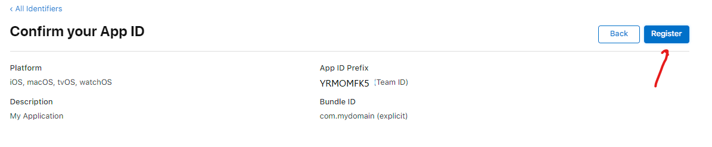
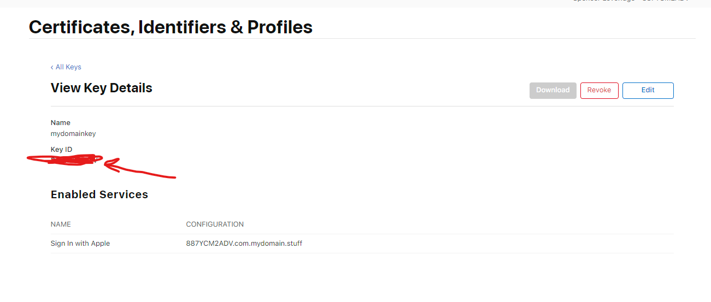

# react-springboot-appengine-template

This is an auto-generated project template.

## Build
To build this project run the following from the command line
```shell
mvn clean install
```

## Configuration
1. To utilise Google OAuth2.0 you will need to create a google account then go [here](https://console.cloud.google.com/apis/credentials) 
2. Click Create Credentials and select Oauth client ID

3. Select External then click Create

4. Fill in the details of your domain / server:

5. Add the scope for the users email

6. Add test users:

7. Go back to the dashboard and create OAuth client ID again (confusing yes I know)

8. Select Web application and add the redirect URIs using the following paths but replace your server domain details:


9. Set the client ID and Client secret  in the [application.yml](./webapp/src/main/resources/application.yml) (use the [PropertyEncryptionUtil](webapp/src/main/java/com/example/utils/PropertyEncryptionUtil.java) to encrypt it)
10. Create an environment variable called *ENC_PASSWORD* which stores your encryption password (keep this safe - obvs)
11. Create an encrypted password and set it as the *tokenSecret* in the [application.yml](./webapp/src/main/resources/application.yml)

# Apple
To utilise Apple OAuth2.0, then strap in buster, it's gonna get rough:
1. Create an account with [Apple Developer](https://developer.apple.com/). This will cost you £70 a year (possibly different where you live) because Apple hate you and want your family to die.
2. When you are all registered and signed up go to the [Identifier Page](https://developer.apple.com/account/resources/identifiers/list)
3. In the top right next your name is your TeamID. Copy this and set it as the **teamId** in the [application.yml](webapp/src/main/resources/application.yml) under the **apple** section

4. Under the Identifiers section ensure "App Id" is selected on the right and then click the add button.

5. Select "App Ids" then continue

6. Select "App" type then continue

7. Enter a description and a BundleID (in reverse domain stylee) but DONT PRESS CONTINUE YET

8. Scroll down to "Sign in with Apple", make sure its selected

9. Now scroll back up and click Continue
10. Then check details and click Register:

11. Next go back to the identifiers page and ensure "Serivce Ids" is selected from the drop down on the right, then click add

12. Add the details as with the application ID but extend with "Service" (you dont have to do this but makes it easier to distinguish). Click Continue, then Register on the next page

13. Back on the identifiers screen, click on your newly created service:

14. Enable sign in with Apple then click "Configure"

15. In the config dialog, make sure your App Id you just created is selected, enter your domain (without protocol prefix), then add the full URL to the call back (https://whateveryourdomainis.com/api/oauth2/callback/apple) - only change the domain, keep the path the same!

16. Click through Continue, then "Save":

17. Now go to the keys menu then click the add button:

18. Enter a key name, select the "Sign in with Apple" and click "Configure"

19. Make sure your app id is selected then click Save:

20. Then click continue:

21. Then Register:

22. You will then be prompted to download your key. Download the file and place it here: [webapp/src/main/resources/security/oauth/apple](webapp/src/main/resources/security/oauth/apple) DO NOT RENAME THE FILE!
23. In the [application.yml](webapp/src/main/resources/application.yml) set the **keyId** to be the same as the  Key ID for the key you created (this will be the same code that is in the filename of the downloaded key):

24. And finally set the **clientId** in [application.yml](webapp/src/main/resources/application.yml) to be the serivceId which in this example was com.myapplication.service

25. Build and deploy to your domain and then when you follow the apple oAuth link (generated from [here](webapp/src/main/java/com/example/controller/LoginControllerApiDelegateImpl.java)) for apple, then quicker than you can say "fuck me that was a colossal ball-ache and infinitely more difficult and expensive than setting up Google Oauth why did I even get into computing in the first place I should have been a dancer or something", then it _should_ authenticate you. 


## Running the application
Once built run the following:
```shell
java -jar webapp/target/react-springboot-appengine-template-*.jar
```
Once started you should be able to view the following:
* The running app: [http://localhost:8080](http://localhost:8080)
* swagger api documentation: [http://localhost:8080/swagger-ui.html](http://localhost:8080/swagger-ui.html)
* swagger api definition json: [http://localhost:8080/v2/api-docs](http://localhost:8080/v2/api-docs)

## Running the UI
```shell
cd ui 
npm run storybook
```
After a short while you should see a browser window open displaying a storybook app that allows you to test the UI components

## Testing Docker
You can test your docker script locally with the folloing command:
```shell
docker build -t maven-caching .
```


_Good luck. We're all counting on you_